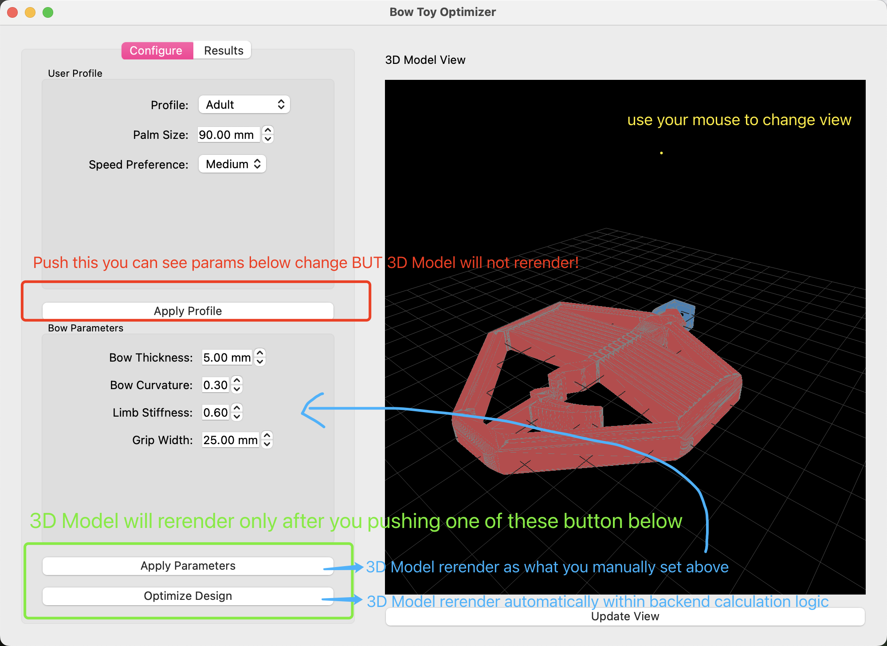

# CMIS P3-PhysicalUI: Handheld Bow and Arrow

Tutorial By Flora

## Project Overview

This project consists of a physics-based optimization system for bow toy designs with a graphical user interface. The application allows users to:

- Select different user profiles (Child, Adult, Professional)
- Customize bow parameters (thickness, curvature, stiffness, grip width)
- Optimize design based on user profiles and preferences
- Simulate performance metrics (launch speed, draw force, accuracy)
- Export the final model as an STL file for 3D printing

## Files Structure

- **BowArrowOpt.py** - Core optimization engine and physics calculations
- **BowArrowUI.py** - PyQt5-based graphical user interface

## For Team Members

### Getting Started

1. You don't need to modify **BowArrowUI.py** - the UI is already complete

2. Focus your attention on **BowArrowOpt.py** where the physics and optimization logic lives
3. Look for `TODO:` comments in BowArrowOpt.py for areas that need improvement

### TODO Items for Implementation

I've marked several areas in BowArrowOpt.py that could use your expertise:

1. **Improve launch speed estimation** - The current physics model is simplified
2. **Enhance draw force calculation** - Needs more accurate physics modeling
3. **Verify optimization method** - Review and enhance the current approach
4. **Update arrow parameter calculations** - Automatic arrow sizing based on bow parameters
5. **Improve performance score calculations** - More realistic performance metrics
6. **Add 3D printing parameter optimization** - Implement the print settings function

### Required Dependencies

- PyQt5
- NumPy
- trimesh
- SciPy
- pyqtgraph

### How to Run

```bash
# Create or Activate your own conda environment
# conda create -n name_of_your_own_env python=3.9 -y
conda activate name_of_your_own_env

# Install dependencies
pip install -r requirements.txt

# Run the application
python BowArrowUI.py
```

Make sure to place an STL model file in the `models` directory for the application to load. You can modify it at in the final part `main()` of `BowArrowUI.py`. Now I'm using `Bow_Arrow_Combined.stl` which includes both bow and arrow (maybe we need to print them saperately later).

## Key Features

### 1. User Profile Selection

The optimizer includes predefined user profiles to quickly tailor the bow design for different user categories:

**Implementation Details:**
- Defined in the `user_profiles` dictionary with three categories: Child, Adult, and Professional
- Each profile contains optimized parameter sets and specific constraints:
  - **Child profile**: Emphasizes safety with larger tips (10mm), thicker bows (6.0mm), lower stiffness (0.4), and wider grips (30mm)
  - **Adult profile**: Balanced parameters with medium values for all settings
  - **Professional profile**: Focuses on accuracy with thinner bows (4.5mm), higher stiffness (0.75), and smaller tips (6mm)
- Profile selection automatically updates all bow and arrow parameters
- User profiles also include safety thresholds (`max_draw_force`, `max_launch_speed`) and weighting factors (`safety_factor`, `speed_factor`)

### 2. Parameter Customization

The optimizer allows fine-tuning of critical bow parameters to adjust performance characteristics:

**Key Parameters:**
- **Bow Thickness** (4.0-7.0mm): Controls bow strength and energy storage
- **Bow Curvature** (0.2-0.4): Affects energy storage and draw smoothness
- **Limb Stiffness** (0.3-0.9): Determines draw force and energy transfer efficiency (mainly apply to 3D print material)
- **Grip Width** (20-35mm): Affects user comfort and handling

**Implementation Details:**
- Parameters are bounded differently for each user profile
- The `refresh_parameters()` method updates all parameters and calculates dependent properties
- Parameter changes trigger automatic recalculation of arrow characteristics
- UI provides direct control through spin boxes with appropriate min/max ranges

**Effects of Parameter Changes:**
- Increasing bow thickness → higher draw force and launch speed
- Increasing curvature → more stored energy but higher draw force
- Increasing stiffness → higher accuracy but requires more strength
- Increasing grip width → better comfort but potentially lower accuracy

### 3. Palm Size Adaptation

The optimizer customizes the grip for different hand sizes to ensure user comfort:

**Implementation Details:**
- Uses `palm_size` parameter (default 90mm for adults) to scale the grip dimensions
- The `adjust_for_palm_size()` method modifies grip width proportionally to palm size
- Additional adjustments made to bow thickness for very large or small hands
- Each user profile includes a `grip_size_factor` to control grip scaling

**Ergonomic Considerations:**
- For children: Wider grips relative to hand size (grip_size_factor = 1.2)
- For professionals: Slightly narrower grips for precise control (grip_size_factor = 0.9)
- Thickness adjustments ensure comfortable grip depth for different hand sizes

### 4. Optimization Algorithm

The system uses advanced optimization techniques to find the best parameter combinations:

**Implementation Details:**
- Uses SciPy's `minimize` function with the L-BFGS-B algorithm
- L-BFGS-B (Limited-memory Broyden-Fletcher-Goldfarb-Shanno with Bounds) is ideal for bounded optimization problems
- Objective function balances multiple competing goals with weighted priorities
- Different constraint sets applied based on user profile
- Small random variations (3%) applied to prevent identical results

**Key Components:**
- **Objective Function**: Calculates weighted sum of squared errors between current and target parameters
- **Constraints**: Ensures safety by penalizing excessive launch speed and draw force
- **Bounds**: Restricts parameters to appropriate ranges for each user profile
- **Random Variation**: Adds manufacturing tolerance simulation

**Optimization Process:**
1. Define initial parameters from current settings
2. Set bounds based on user profile
3. Run L-BFGS-B optimization
```python
   # Run optimization
   # Including: bow_thickness, bow_curvature, limb_stiffness for different user type and bow_width should be fixed
        result = minimize(obj_func, initial_guess, method='L-BFGS-B', bounds=bounds)
```

5. Apply small random variations to results
6. Calculate optimal arrow parameters for the optimized bow
7. Update 3D model geometry


### 5. Performance Simulation

The optimizer simulates real-world performance to evaluate design quality:

**Implementation Details:**
- The `simulate_performance()` method calculates key performance metrics
- Physics-based models estimate launch speed, draw force, and flight distance
- Performance scores are calculated and weighted differently based on user profile
- Results include numerical ratings for accuracy, comfort, safety, and overall performance

**Key Metrics:**
- **Launch Speed** (m/s): Velocity of arrow at release
- **Draw Force** (N): Force required to fully draw the bow
- **Flight Distance** (m): Estimated range of arrow flight
- **Accuracy Score** (0-100): Rating for shot consistency and precision
- **Comfort Score** (0-100): Rating for ease of use and ergonomics
- **Safety Score** (0-100): Rating for injury prevention and stability
- **Overall Score** (0-100): Weighted combination of all metrics

**Profile-Specific Scoring:**
- Children: Safety (50%) and comfort (30%) weighted heavily
- Professionals: Accuracy (50%) and distance (20%) prioritized
- Adults: Balanced weighting across all metrics

### 6. 3D Visualization

The system provides real-time visual feedback of design changes:

**Implementation Details:**
- Uses PyQtGraph's OpenGL widget (`GLViewWidget`) for 3D rendering
- The UI's `update_model_view()` method refreshes the visual representation
- Model is split into components (bow body and arrow) for separate manipulation
- Different colors applied to distinguish components

**Visualization Process:**
1. Extract vertex and face data from optimizer's current model
2. Process each component separately with appropriate color assignment
3. Combine data into OpenGL mesh item
4. Add to view widget with appropriate camera positioning

**Rendering Features:**
- Smooth surface rendering with edge highlighting
- Color-coded components (bow in red, arrow in blue)
- Reference grid for size comparison
- Camera position adjustment for optimal viewing

### 7. STL Export

The optimizer can export the final design for 3D printing:

**Implementation Details:**
- The `export_model()` method in the optimizer generates STL files
- Uses Trimesh library for mesh processing and export
- Combines multiple components into a single printable mesh
- File dialog allows user to specify save location

**3D Printing Considerations:**
- Parameters are kept within printable ranges
- Component assembly is designed for single-piece printing
- Future implementation will include print settings recommendations

## Next Steps: Physics Estimation & Optimization Methods

### `estimate_launch_speed(bow_thickness, bow_curvature, limb_stiffness)`

This method calculates the estimated arrow launch speed based on the physical properties of the bow.

**Current Implementation:**
- Uses a simplified physics model where launch speed is calculated as a function of bow thickness, curvature, and limb stiffness
- Base speed is set at 3.0 m/s which is then modified by the parameters
- Thicker bows produce higher speeds (scaled by `bow_thickness / 5.0`)
- More curved bows store more energy (scaled by `1 + bow_curvature`)
- Stiffer limbs transfer more energy to the arrow (scaled directly by `limb_stiffness`)

**Limitations:**
- Doesn't account for energy losses during the draw-release cycle
- Doesn't consider arrow mass in the speed calculation
- Simple multiplicative model rather than proper physics simulation

### `estimate_draw_force(bow_thickness, bow_curvature, limb_stiffness)`

This method estimates the force required to fully draw the bow based on its physical parameters.

**Current Implementation:**
- Base force is set at 4.0 N
- Force increases with bow thickness (scaled by `bow_thickness / 5.0`)
- Curvature has a modest effect on draw force (scaled by `1 + 0.5 * bow_curvature`)
- Limb stiffness directly affects draw force (scaled by `limb_stiffness`)

**Limitations:**
- Doesn't model the non-linear force profile of real bows
- Doesn't account for draw length variations
- Simple multiplicative model rather than using beam physics

### `objective(x, user_profile)`

This is the objective function used in the optimization process to find the best bow parameters.

**Current Implementation:**
- Takes parameter vector `x` (bow_thickness, bow_curvature, limb_stiffness) and user profile
- Calculates a weighted sum of squared errors between current and target parameters
- Applies different weights based on user profile (Child, Adult, Professional)
- Includes safety constraints with penalties for excessive launch speed and draw force
- Considers palm size in the optimization goal

**Key Features:**
- For children: Prioritizes safety (weight 3.0) over performance
- For professionals: Emphasizes stiffness (weight 2.0) for consistency
- For adults: Balances all parameters equally (weight 1.0)
- Applies penalty functions when constraints are violated
- Adapts optimization target based on user's palm size

### `optimize_model()`

This method runs the optimization algorithm to find the best parameters for the current user profile.

**Current Implementation:**
- Uses scipy's L-BFGS-B optimizer (Limited-memory Broyden-Fletcher-Goldfarb-Shanno with Bounds)
- Sets different parameter bounds based on user profile
- Applies small random variations (3%) to prevent identical results
- Calculates optimal arrow parameters based on the optimized bow parameters
- Updates the 3D model geometry with the new parameters

**Key Features:**
- Bounds are defined specifically for each user profile:
  - Children: Thicker bows (5.0-7.0 mm), lower curvature (0.2-0.3), lower stiffness (0.3-0.5)
  - Adults: Medium values for all parameters
  - Professionals: Thinner bows (4.0-5.0 mm), higher curvature (0.3-0.4), higher stiffness (0.7-0.9)
- Includes random variations to simulate manufacturing tolerances
- Ensures optimized parameters stay within defined bounds
- Automatically calculates matching arrow parameters for the optimized bow

### Specific:

1. **For `estimate_launch_speed()`**:
   - Implement Hooke's Law for energy storage calculation
   - Add arrow kinetic energy (½mv²) calculation
   - Model the energy transfer efficiency between bow and arrow

2. **For `estimate_draw_force()`**:
   - Implement beam deflection physics for more accurate force modeling
   - Add a non-linear force curve model that represents real bow behavior
   - Consider material properties like Young's modulus

3. **For `objective()`**:
   - Add constraints for manufacturability (3D printing limitations)
   - Include more sophisticated safety metrics for children's profile
   - Add constraints for consistent arrow flight (stability)

4. **For `optimize_model()`**:
   - Experiment with different optimization algorithms (e.g., genetic algorithms)
   - Implement multi-objective optimization to balance competing goals
   - Add sensitivity analysis to understand parameter importance
   - Adjust optimal arrow parameters (size) to fit the optimized bow
   - Incorporate real-world test data to refine optimization targets
5. **STL Export**:
   - Add material-specific print setting recommendations
